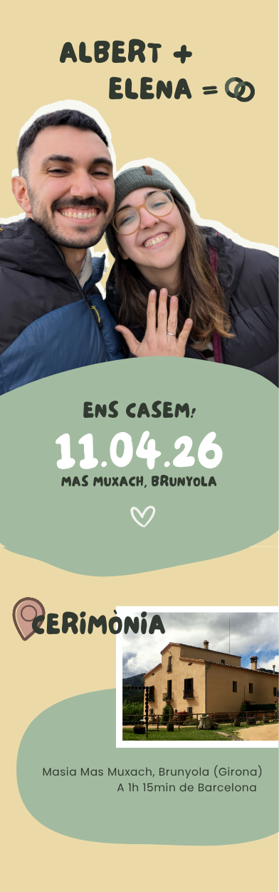

# Albert&Elena

💍 Wedding website for Albert & Elena

> [!NOTE]
> **🔗 Live Demo:** [asuarez.dev/albert-elena](https://asuarez.dev/albert-elena)

## Summary

This is a simple, static, and responsive wedding website celebrating the marriage of Albert and Elena on **April 11th, 2026**. The wedding will take place at [Mas Muxach](https://maps.app.goo.gl/V6TaM6MgLW6GKd8U9), and guests are invited to stay overnight from Saturday to Sunday, with breakfast provided on Sunday morning.

### Wedding Details

#### Event Schedule

- **Date:** April 11th, 2026 (Saturday)
- **Start Time:** 12:30 PM
- **Venue:** [Mas Muxach](https://maps.app.goo.gl/V6TaM6MgLW6GKd8U9)
- **Accommodation:** Overnight stay available (Saturday to Sunday)
- **Breakfast:** Sunday morning for overnight guests

#### Celebration Program

1. **Ceremony (12:30 PM):** Short wedding ceremony with family and friends
2. **Reception:** Mixed format with standing finger food and seated lunch
3. **Menu:** Full vegetarian menu featuring two courses and dessert
4. **Evening:** Open bar with DJ music and dancing

#### Special Notes

- **Dietary:** The entire celebration will be fully vegetarian
- **Accommodation:** Guests can stay overnight at the venue
- **Language:** All website content is in Catalan

### Website Features

The wedding website includes the following sections:

- **Event Information:** Date, time, and location details
- **Venue Details:** Information about Mas Muxach and accommodation
- **Schedule:** Timeline of the day's events
- **FAQ Section:** Answers to common guest questions
- **RSVP Form:** Guest attendance confirmation and information collection
- **Dietary Requirements:** Information about the vegetarian menu
- **Contact Information:** How to reach the couple for questions

> [!IMPORTANT]  
> The website content is fully in Catalan to accommodate the local guests and venue.

### Technical Specifications

- **Type:** Static, responsive website
- **Language:** Catalan
- **Target Audience:** Wedding guests and family
- **Primary Function:** Information sharing and RSVP collection
- **Design:** Mobile-first, elegant, and user-friendly

## Mock Up

Mock-up design created in [Canva](https://www.canva.com/) by [Elena Ruiz](https://github.com/elena20ruiz).

## Screenshots

_Coming soon..._

## Authors

- [Albert Suàrez](https://github.com/AlbertSuarez)
- [Elena Ruiz](https://github.com/elena20ruiz)
